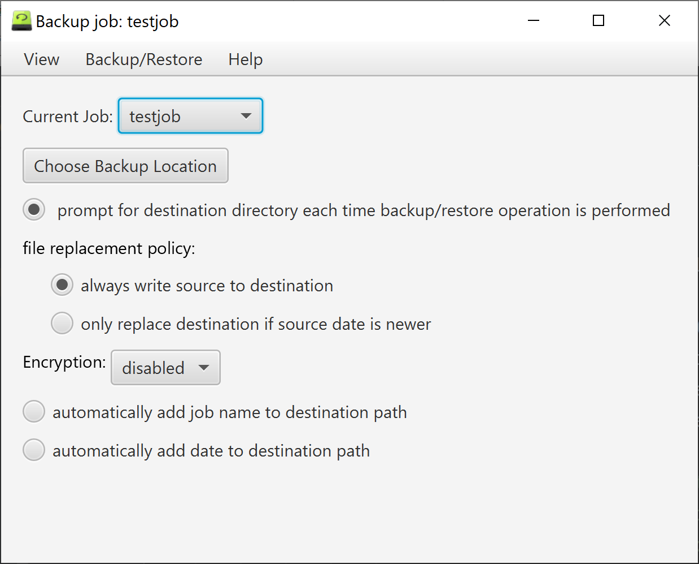

# backup-utility
a desktop utility for backing up and restoring selected files and directories

The project is written in Java and uses JavaFX for the GUI.

The user selects files and or directories that they want to backup and then simply performs the backup operation.  If the backup destination has not been specified, the user will be prompted for a destination directory for where the files will be backup at.  The destination can be another directory on the host machine, a directory on a mounted thumb drive or a directory at some reachible network location. Obviously, the user must have the proper permissions to both read and write from the source and destination location.

The utility allows the user to create any number of backup jobs.  A backup job is simply the list of selected files and directories and a set of job options which affect how the backup operation is performed.

If a backup job has encryption enabled, the backed up file are encrypted when stored at the destination. Encrypted files require a password or pass phrase to be entered when the when the file are backed up or restored. The same password or pass phrase is required in order to restore encrypted backup content. The utility cannot recover encrypted content if the password or pass phrase is lost or forgotten.  The utility is however capable of detecting that an encrypted file was supplied with a valid password or pass phrase, but the utility itself it doesn't keep or store the password or pass phrase.

A backup job can also be made to append either the  job name or the time/date of the backup to the destination path or both. Jobs that that have the time/date appended to the destination path are capable or maintaining the last n backup copy, where n is specified by the user.

The utility contains an embedded User Guide that explains the operation of the applicaton in greater detail.

